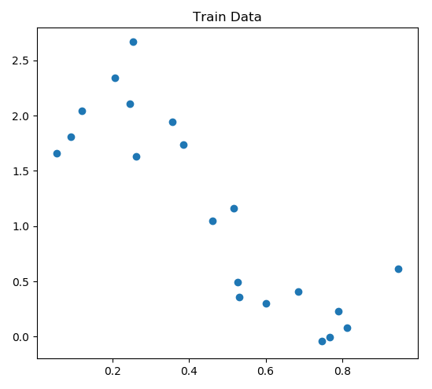
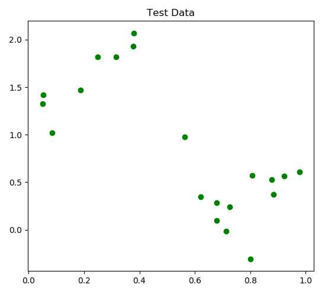
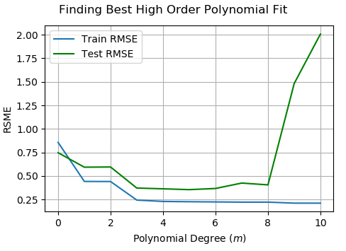

---
# vim: set ft=pandoc :
title: 'Problem Set 2: Implementation of Polynomial Regression'
author: 'Rodrigo Valle'
date: '10 November 2018'
header-includes:
 - \usepackage{mathtools}
 - \usepackage{siunitx}
---

NOTE: For the code samples in this assignment I've used Python 3.

# Visualization

<!--
  Visualize the training and test data using the plot_data(...) function. What
  do you observe? For example, can you make an educated guess on the
  effectiveness of linear regression in predicting the data?
-->
  {width=250px}\ {width=250px}

  a) The training data looks like it could be estimated well by a linear
     function, but it looks like fitting a 3rd or 5th degree polynomial function
     might yield even better results. Actually, if I had to guess, this looks
     like a sine wave with some noise added to it!

\pagebreak

# Linear Regression

<!--
  Note that to take into account the intercept term (w_0), we can add an
  additional "feature" to each instance and set it to one, e.g. x_{i,0} = 1.
  This is equivalent to adding an additional first column to X and setting it to
  all ones.
  Modify PolynomialRegression.generate_polynomial_features(...) to create the
  matrix for a simple linear model.
-->
  b) Modify `PolynomialRegression.generate_polynomial_features(...)` to create
     the matrix $X$ for a simple linear model.
     ```python
     def generate_polynomial_features(self, X):
         N, d = X.shape  # X is of shape (N,1)
         Phi = np.concatenate([np.ones((N,1)), X], axis=1)
         return Phi
     ```

<!--
  Before tackling the harder problem of training the regression model, complete
  PolynomialRegression.predict(...) to predict y from X and w.
-->
  c) Complete `PolynomialRegression.predict(...)` to predict $\textbf{y}$
     from $X$ and $\textbf{w}$.

     ```python
     def predict(self, X):
         ...
         X = self.generate_polynomial_features(X)
         y = np.matmul(X, self.coef_)
         return y
     ```

  d) Gradient Descent

     - Implement `PolynomialRegression.cost(...)` to calculate $J(\textbf{w})$.

       ```python
       def cost(self, X, y):
           X = self.generate_polynomial_features(X)
           cost = np.sum(np.power(np.matmul(X, self.coef_) - y, 2))
           return cost
       ```
     - Implement the gradient descent step in `PolynomialRegression.fit_GD(...)`.

       ```python
       def fit_GD(self, X, y, eta=None, eps=0, tmax=10000, verbose=False):
           ...
           X = self.generate_polynomial_features(X)
           n, d = X.shape
           self.coef_ = np.zeros(d)
           err_list = np.zeros((tmax, 1))

           for t in range(tmax):
               ...
               y_pred = np.matmul(X, self.coef_)
               gradient = 2 * eta * np.matmul(X.T, y_pred - y)
               self.coef_ = self.coef_ - gradient

               # track error
               # hint: you cannot use self.predict(...)
               # to make the predictions
               err_list[t] = np.sum(np.power(y - y_pred, 2)) / n
               ...
           ...
           return self
       ```
  <!--
    So far, you have used a default learning rate (or step size) of eta = 0.01.
    Try different eta = 10^-4, 10^-3, 10^-2, 0.0407, and make a table of
    coefficients, number of iterations until convergence (this number will be
    10,000 if the algorithm did not converge in a smaller number of iterations)
    and the final value of the objective function. How do the coefficients
    compare? How quickly does each algorithm converge?
  -->
    \setlength\arraycolsep{3pt}

     - Try varying the learning rate ($\eta$) and compare the learned
       coefficients, number of iterations until convergence, and the final value
       of the objective function.

         $\eta$    Iterations  Coefficients ($\textbf{w}$)                                       $J(\textbf{w})$
       ---------- ----------- ----------------------------------------------------------------- -----------------
       $10^{-4}$        10000 $\begin{pmatrix}2.270 & -2.461\end{pmatrix}^T$                    4.086
       $10^{-3}$         7021 $\begin{pmatrix}2.446 & -2.816\end{pmatrix}^T$                    3.912
       $10^{-2}$          765 $\begin{pmatrix}2.446 & -2.816\end{pmatrix}^T$                    3.912
        0.0407          10000 $\begin{pmatrix}\num{-9.405e18} & \num{-4.652e18}\end{pmatrix}^T$ $\num{2.711e31}$

      \setlength\arraycolsep{3pt}

      The coefficients, when GD was given the opportunity to converge, are
      around $\begin{pmatrix}2.45 & -2.82\end{pmatrix}^T$.
      
      At $\eta = 10^{-4}$, the coefficients that are close to optimal, but GD
      still requires more iterations/steps to finish converging and get closer
      to the optimum cost.

      At $\eta = 10^{-3}$ and $\eta = 10^{-2}$, GD converges to very similar
      weight vectors, equivalent to 5 decimal places. $\eta = 10^{-3}$,
      predictably, uses an order of magnitude more iterations to converge.

      At $\eta = 0.0407$, we see that GD actually diverges from the solution by
      taking steps too large to descend towards the optimum. The coefficients
      contain whatever point the algorithm was currently bouncing from when it
      hit the hard upper limit of 10,000 iterations.

  e) Closed Form Solution

     - Implement the closed form solution `PolynomialRegression.fit(...)` 
       ```python
       def fit(self, X, y):
           # note: '@' is shorthand for np.matmul(...)
           X = self.generate_polynomial_features(X)
           self.coef_ = np.linalg.pinv(X.T @ X) @ X.T @ y
       ```

     - What is the closed form solution? How do the coefficients and the cost
       compare to those obtained by GD? How quickly does the algorithm run
       compared to GD?

       The closed form solution for linear regression gives the values of the
       coefficients as:
       $$\textbf{w} \approx \begin{pmatrix}2.446\\-2.816\end{pmatrix}$$
       Which are the same values to which gradient descent converged previously.
       The cost is predictably identical to the final cost computed by gradient
       descent: 3.912.

       A timed comparison of the two methods was also performed using python's
       `timeit` module, taking the average wall execution time out of 10,000
       trials.

       Closed Form        Iterative (Gradient Descent)
       ------------------ ----------------------------
       $\SI{9.653e-5}{s}$ $\SI{1.25e-2}{s}$

<!--
  Finally, set a learning rate eta for GD that is a function of k (the
  number of iterations) (use n_k = 1/(1+k)) and converges to the same solution
  yielded by the closed form optimization (minus possible rounding errors).
  Update PolynomialRegression.fit_GD(...) with your proposed learning rate. How
  long does it take the algorithm to converge with your proposed learning rate?
-->
  f) Update `PolynomialRegression.fit_GD(...)` with the learning rate
     $\eta_k = \frac{1}{1+k}$. How long does it take the algorithm to converge
     with this learning rate?

     ```python
     def fit_GD(self, X, y, eta=None, eps=0, tmax=10000, verbose=False):
         eta_input = eta
         ...
         for t in range(tmax):
            if eta_input is None:
                eta = 1 / (1 + t)
            ...
         ...
         return self
     ```

     With this dynamic learning rate, gradient descent takes 1719 iterations to
     converge, which is about 1000 more iterations than setting $\eta = 0.01$
     from before, but roughly 5000 fewer iterations than setting $\eta = 0.001$.

     The advantage of this dynamic learning rate is that GD can spend a little
     more time scanning for an appropriate learning rate automatically as it
     iterates instead of a human trying to find the problem-specific learning
     rate by hand.

\pagebreak

# Polynomial Regression

  g) Update `PolynomialRegression.generate_polynomial_features(...)` to create
     an $m + 1$ dimensional features vector for each instance.

     ```python
     def generate_polynomial_features(self, X):
         phi = np.concatenate([X**i for i in range(self.m_ + 1)], axis=1)
         return phi
     ```

  h) Why do you think we might prefer RMSE as a metric over $J(\textbf{w})$?
     Implement `PolynomialRegression.rms_error(...)`.

     RMSE is essentially calculating the standard deviation of the distribution
     of every example's distance from the model's prediction. Optimizing the
     RMSE will yield the same result as optimizing the variance, which is what
     the cost function $J$ computes, so from a training perspective there's not
     much difference. However, the key advantage is that the standard deviation
     is in the same units as the mean, so it's much easier for a human to
     conceptualize and compare.
     
     ```python
     def rms_error(self, X, y):
         n, d = X.shape
         error = np.sqrt(self.cost(X, y) / n)
         return error
     ```

<!--
  For m = 0, ..., 10, use the closed-form solver to determine the best-fit
  polynomial regression model on the training data, and with this model,
  calculate the RMSE on both the training data and the test data. Generate
  a plot depicting how RMSE varies with model complexity (polynomial degree $m$)
  - you should generate a single plot with both training and test error, and
  include this plot in your writeup. Which degree polynomial would you say best
  fits the data? Was there evidence of under/overfitting the data? Use your plot
  to justify your answer.
-->
  i) Comparing different choices of the polynomial degree $m$ yields the
     following plot:

     {width=380px}

     From the plot, fitting a polynomial of degree 5 reported the lowest error
     on the test data with a test error of 0.3551 and a train error of 0.2268.

     We can clearly see on the plot that the model begins severely overfitting
     past an 8th degree polynomial as training error continues to decline but
     a sharp increase in test error is observed.

<!--
      $m$  Train RMSE Test RMSE
     ----- ---------- ---------
       0    0.86       0.75
       1    0.44       0.59
       2    0.44       0.60
       3    0.24       0.37
       4    0.23       0.36
       5    0.23       0.36
       6    0.22       0.37
       7    0.22       0.43
       8    0.22       0.41
       9    0.21       1.48
      10    0.21       2.01
-->
