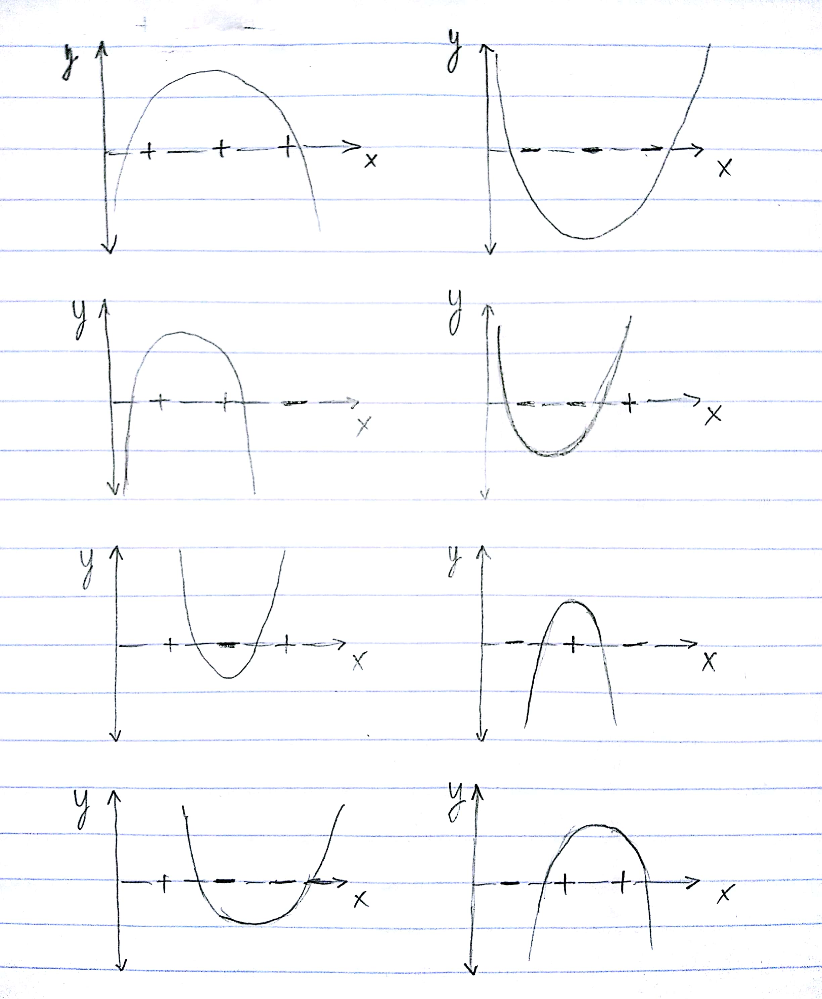

# VC Dimension

We define a set of concepts
\[
    H = \{ \text{sgn}(ax^2 + bx + c) \mid a, b, c \in \mathbb{R} \}
\]
where
\begin{equation*}
    \text{sgn}(x) = \begin{cases}
                    1 \text{ if } x \geq 0 \\
                    0 \text{ otherwise}
                    \end{cases}
\end{equation*}

What is the VC dimension of $H$? Prove your claim.

---

The VC dimension of $H$ is 3.

<!--
## Proof 

The class of decision boundaries that we can get with $H$ are invervals on the
$x$ axis.

For some interval $I = [y_0, y_1]$, our prediction can be set so that
\[
    \hat y = \begin{cases}
             1 \text{ if } x \in I \\
             0 \text{ else }
             \end{cases}
\]
or
\[
    \hat y = \begin{cases}
             0 \text{ if } x \in I \\
             1 \text{ else }
             \end{cases}
\]

### Hypothesis $\Rightarrow$ Interval

The decision boundaries of a hypothesis function are defined by the values of
$x$ that satisfy $ax^2 + bx + c = 0$. If $a \neq 0$:
\[
    x = \dfrac{-b \pm \sqrt{b^2 - 4ac}}{2a}
\]

 - If \(b^2 - 4ac > 0\), then there are two such values of $x$, which form
   the interval $I = [x_0, x_1]$.

    - If $a > 0$, then the parabola faces up and the
      decision is:
      \[
      \hat y = \begin{cases}
               0\ \forall x \in I\\
               1\ \text{else}
               \end{cases}
      \]
    - If $a < 0$, then the parabola faces down and the decision is
      \[
      \hat y = \begin{cases}
               1\ \forall x \in I\\
               0\ \text{else}
               \end{cases}
      \]

 - If \(b^2 - 4ac = 0\), our interval is simply $I = [x_0, x_0]$ and we can use
   the same reasoning in the last bullet point.

 - If \(b^2 - 4ac < 0\), then the quadratic has no real valued roots.

    - If $a < 0$, then the parabola faces up and is above $x = 0$. The decision
      is
      \[
      \hat y = 1\ \forall x
      \]
    - If $a > 0$, then the parabola faces down and is below $x = 0$. The
      decision is
      \[
      \hat y = 0\ \forall x
      \]

 - If $a = 0$, we have the line $bx + c$, for which the decision boundary can
   only change once along all $x$. That is at some point along $x$ the decision
   boundary will flip.

-->

### Proof

We first show that we can shatter a set of size 3 using functions from our
hypothesis space. A set of size 3 in the context of our classification space is
just three points along an axis, call it the x-axis. For every possible labeling
of these points, we show graphically in Figure 1 that there is a function from
our hypothesis space that can correctly classify these points. This function is
a parabola, when the parabola is above the x-axis it is classifying points on
the x-axis as positive; when the parabola is below the x-axis those points on
the x-axis are classified as negative, i.e. we classify according to the sign of
parabola's output.

\pagebreak

{width=70%}

Now that we have shown that a set of size 3 points is shatterable by our class
of hypothesis functions by exhaustively showing every case, we can continue to
show that a set of 4 points is not shatterable by considering the counterexample
of four labeled points along the x-axis:

\[ +\quad-\quad+\quad- \]

A parabola can partition the continous x-axis into as many as three parts, one
line segment with label $y$ and two rays on either side with label $\overline{y}$.
If we model this as a change of state along the x-axis we can say that the
parabola can flip its current classification "state" twice along the entire
x-axis. From the counter example, we observe that in order to correctly classify
this case we would have to flip state three times, which is more than any
parabolic hypothesis function can represent as a parabola can intersect the
x-axis only twice. So, a set of any 4 points is not shatterable, but a set of
3 points is shatterable by our class of hypotheses functions. Since the VC
dimension is defined as the cardinality of the largest set of points that our
model can shatter, the VC dimension of $H$ is three.

# Kernels

Given vectors $\mathbf{x}$ and $\mathbf{z}$ in $\mathbb{R}^2$, define the kernel
$K_\beta(\mathbf{x},\mathbf{z}) = (1 + \beta \mathbf{x} \cdot \mathbf{z})^3$ for any
value $\beta > 0$. Find the corresponding feature map $\phi(\cdot)$. What are
the similarities/differences from the kernel $K(\mathbf{x},\mathbf{z}) = (1
+ \mathbf{x}\cdot\mathbf{z})^3$, and what role does $\beta$ play?

---

\begin{align*}
    K(\mathbf{x}, \mathbf{z}) =& \phi(\mathbf{x}) \cdot \phi(\mathbf{z})\\
                              =& (1 + \beta \mathbf{x} \cdot \mathbf{z})^3\\
                              =& 1 + 3 (\beta \mathbf{x} \cdot \mathbf{z}) + 3 (\beta \mathbf{x} \cdot \mathbf{z})^2 + (\beta \mathbf{x} \cdot \mathbf{z})^3\\
                              =& 1 + 3 \beta (x_0 z_0 + x_1 z_1) + 3 \beta^2 (x_0 z_0 + x_1 z_1)^2 + \beta^3 (x_0 z_0 + x_1 z_1)^3\\
                              =& 1 +\\
                               & 3 \beta x_0 z_0 +\\
                               & 3 \beta x_1 z_1 +\\
                               & 3 \beta^2 x_0^2 z_0^2 +\\
                               & 6 \beta^2 x_0 x_1 z_0 z_1 +\\
                               & 3 \beta^2 x_1^2 z_1^2 +\\
                               & \beta^3 x_0^3 z_0^3\\
                               & 3 \beta^3 x_0^2 x_1 z_0^2 z_1\\
                               & 3 \beta^3 x_0 x_1^2 z_0 z_1^2\\
                               & \beta^3 x_1^3 z_1^3
\end{align*}

\[
\phi(\mathbf{v}) =
    \begin{pmatrix}
        1\\
        \sqrt{3 \beta}   v_0\\
        \sqrt{3 \beta}   v_1\\
        \sqrt{3} \beta   v_0^2\\
        \sqrt{6} \beta   v_0 v_1\\
        \sqrt{3} \beta   v_1^2\\
        \sqrt{\beta^3}   v_0^3\\
        \sqrt{3 \beta^3} v_0^2 v_1\\
        \sqrt{3 \beta^3} v_0 v_1^2\\
        \sqrt{\beta^3}   v_1^3
    \end{pmatrix}
\]

It seems that $\beta$ scales each polynomial dimension by an amount related to
the number of features from the original vector in $\mathbb{R}^2$ that make up
the polynomial dimension. For example, linear dimensions like $\sqrt{3 \beta}
v_0$ are scaled by an amount proportional to $\sqrt{\beta}$. Quadratic
dimensions are scaled by an amount proportional to $\beta$, and cubic dimensions
are scaled by an amount proportional to $\sqrt{\beta^3}$. From this observation,
it would seem that $\beta$ really scales the distance that is reported by the
kernel function from computing the dot product in this higher dimensional space
mapped to by $\phi$ --- that is, beta scales the similarity between vectors
reported by the kernel function.

# SVM

Suppose we are looking for a maximum-margin linear classifer *through the
origin*, i.e. $b = 0$ (also hard margin, i.e., no slack variables). In other
words, we minimize \(\frac{1}{2} ||\mathbf{w}||^2\) subject to \(y_n
\mathbf{w}^T \mathbf{x}_n \geq 1\) where \(n = 1 \ldots N\).

a) Suppose we have two training examples, $\mathbf{x}_1 = (1, 1)^T$ and
   $\mathbf{x}_2 = (1, 0)^T$ with labels $y_1 = 1$ and $y_2 = -1$. What is
   $\mathbf{w}^*$ in this case?

   \[
       \mathbf{w}^* =
       \begin{pmatrix}
          -1\\
           2
       \end{pmatrix}
   \]

   This choice of $\mathbf{w}^*$ minimizes $\frac{1}{2}||\mathbf{w}||^2$ because
   $y_n \mathbf{w}^{*T} x_n = \gamma = 1$ over all $n$ examples. That is:

   \begin{align*}
       y_1 \mathbf{w}^*x_1 &=
       1 \cdot
       \begin{pmatrix}
          -1\ 2
       \end{pmatrix}
       \begin{pmatrix}
          1\\
          1
      \end{pmatrix} = 1 \cdot (-1 \cdot 1 + 2 \cdot 1) = 1
      \\
      y_2 \mathbf{w}^*x_2 &=
      -1 \cdot
      \begin{pmatrix}
         -1\ 2
      \end{pmatrix}
      \begin{pmatrix}
         1\\
         0
      \end{pmatrix} = -1 \cdot (-1 \cdot 1 + 2 \cdot 0) = 1
   \end{align*}

   Choosing a smaller $\textbf{w}^*$ would cause these predictions to become
   less than 1, which violates our optimization constraint. Additionally, since
   SVM is a convex optimization problem, the minimal $\mathbf{w}^*$ that we have
   discovered must be a global minimum in the optimization problem, which means
   we have the best possible $\mathbf{w}^*$.

b) Suppose we now allow the offset parameter $b$ to be non-zero. How would the
   classifier and the margin change in the previous question? What are the
   $(\mathbf{w}^*, \mathbf{b}^*)$? compare your solutions with and without the
   offset.

   \[
       (\mathbf{w}^*, \mathbf{b}^*) = \bigg(\begin{pmatrix}0\\2\end{pmatrix}, -1\bigg)
   \]

   We see that for this choice of $(\mathbf{w}^*, \mathbf{b}^*)$, $\mathbf{w}^*$
   is minimal because $y_n \mathbf{w}^{*T} x_n = \gamma = 1$ over all $n$
   examples. If we were to choose a smaller $\mathbf{w}^*$ our margins would be
   less than 1, which violates our constraint. Additionally, since SVM is
   a convex optimization problem, the minimal $\mathbf{w}^*$ that we have
   discovered must be a global minimum in the optimization problem, which means
   we have the best possible $\mathbf{w}^*$.

   \begin{align*}
       y_1 (\mathbf{w}^*x_1 + b) &=
       1 \cdot
       \begin{pmatrix}
          0\ 2
       \end{pmatrix}
       \begin{pmatrix}
          1\\
          1
      \end{pmatrix} = 1 \cdot ((0 \cdot 1 + 2 \cdot 1) - 1) = 1
      \\
      y_2 (\mathbf{w}^*x_2 + b) &=
      -1 \cdot
      \begin{pmatrix}
         0\ 2
      \end{pmatrix}
      \begin{pmatrix}
         1\\
         0
      \end{pmatrix} = -1 \cdot ((0 \cdot 1 + 2 \cdot 0) - 1) = 1
   \end{align*}

   With the bias, our minimized separating hyperplane normal of the hard-margin
   linear SVM has a magnitude of 2. Without the bias, the separating hyperplane
   normal has a magnitude of $\sqrt{5}$, which is greater than 2.

   The SVM that is allowed to choose a bias offset has more possible hyperplanes
   to choose from, and is thus more expressive, than the SVM that must choose
   a hyperplane through the origin. So, it makes sense that SVM with more
   freedom to choose selects a more optimal weight vector
   ($\frac{1}{2}||\mathbf{w}^*||^2$ is smaller for the more expressive SVM).
